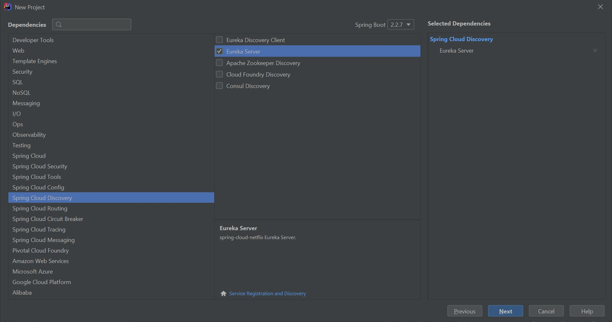
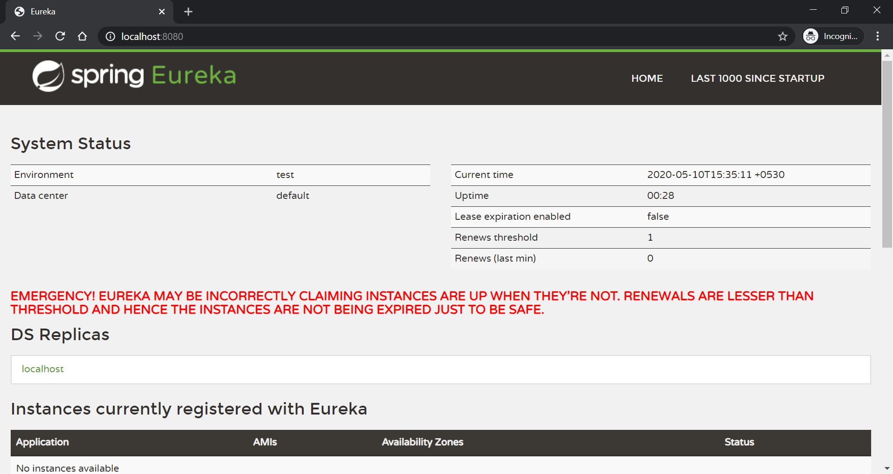

This guide walks you through the process of setting up Netflix Eureka service registry.

#### Setting up the project in Intellij

I would be setting up the project using the Spring Initializr within Intellij Idea. Select the **Eureka Server** dependency under **Spring Cloud Discovery**.
Click next and finish setting up your project.



> Spring also provides a easy and a fast way to setup your project with a [Spring Initializr Portal](https://start.spring.io/)

Open your main class and at the top add `@EnableEurekaServer`. That's it. That's all you need to set up a Eureka Server

Optionally in our `application.properties` or `application.yml` there are 2 properties which you can change.
As this a standalone eureka, you don't need to register with yourself. To do that set the property `eureka.client.register-with-eureka=false`
Also as you don't need a local copy of the registry as the application is acting as a registry itself, we can disable it by setting `eureka.client.fetch-registry=false`


```yml
eureka:
  client:
    register-with-eureka: false
    fetch-registry: false
```

Start your application and navigate to http://localhost:8080 from you browser. You should see the Eureka console.
The eureka console will have basic information like the eureka server itself and the instances registered with this server, which in our case would be zero.



Full code for this guide is available at [Github](https://github.com/jaypac/blog-tutorials/tree/master/spring/cloud/eureka/create-standalone-eureka-server)